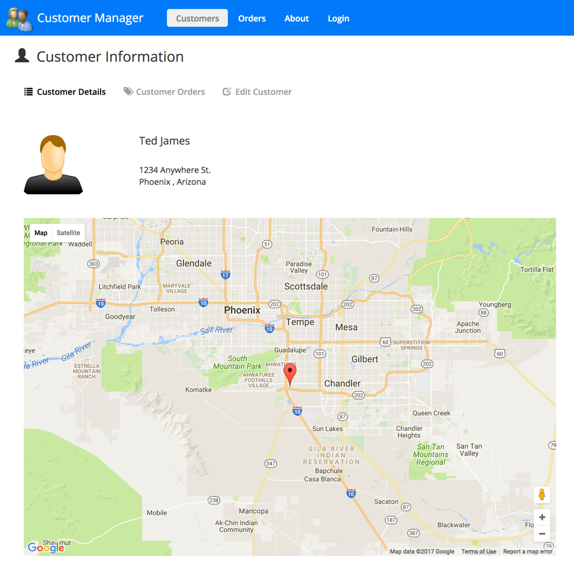

## Building application.

*  DEV Mode (default)
	mvn -f studente\front-end\pom.xml clean package

*  Production mode
	mvn -f studente\front-end\pom.xml clean package -P prod

## Running the Application

1. Install `Node.js 6.11` or higher. *IMPORTANT: The server uses ES2015 features AND the Angular CLI so you need Node 6.11 or higher!!!!*

1. Run `npm install` to install app dependencies

l. run `npm install bootstrap`

1. Download bootstrap.css from <https://bootswatch.com/4/materia/bootstrap.css> and paste it inside node_modules/bootstrap/dist/css/bootstrap.css
    -> link of reference <https://bootswatch.com/4/materia/>

1. Run `ng build --watch` to build and bundle the code

1. Run `npm start` in a separate terminal window to build the TypeScript, watch for changes and launch the web server

1. Go to http://localhost:3000 in your browser 

Simply clone the project or download and extract the .zip to get started. Here are a few
screenshots from the app:

  

  

  

## Running Angular Playground

This application includes Angular Playground (http://www.angularplayground.it) which provides a great way to isolate components in a sandbox rather than loading the 
entire application to see a given component. To run the playground run the following command:

`npm run playground`

